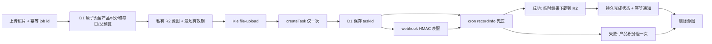

# Kie：可选 AI 接入分支

Kie 是建站时视频、图片、音频需求的候选之一，不是必选供应商。先按模型能力、质量、账户价格、等待时间和产品现有网关契约选择。入口只在这里；模型快照见 [模型目录](kie-models.md)，实现只在 [复制包](../../templates/kie/README.md)，可复用资产登记见 [registry](../registry.md)。

## 何时选择

- 多模型试选、原生多图参考视频、异步图片生成时，可用统一 Market jobs 接口减少客户端重复实现。Seedance、Wan、Kling、Grok、GPT Image、Nano 等家族字段不同，不能只替换 model 名。音乐/Suno、语音/TTS、音效及部分 Veo/Runway 使用专用端点：查 [官方索引](https://docs.kie.ai/llms.txt)，本分支未实测音频/专用协议，不能直接套 Market 客户端。
- 对比 Google 直连：原厂身份、现成 Gemini 契约或组织要求优先时用 Google；Kie 可提供不同家族统一任务入口。对比 fal/其他通道：先核特定模型可用性、参数、单价、作品质量与已有数据链；某通道有 DreamActor 不等于 Kie Kling 等价。OpenRouter chat 图片的 message.images、视频 seed/provider 等字段不能照搬。
- 已有受管网关的产品由产品→网关→Kie 调用；保留产品端 API、文件存储和费用解析。轻量 Worker 产品可直接使用下方方案。支付供应商与 Kie 无耦合，支付按 [支付路由](../monetization.md) 选择。

## 接入架构与职责



这是通用上传方案；既有示例产品生产代码直接给 Kie 短时签名源图 URL，案例批量脚本才用 file-upload。两种方式皆可，不能把案例上传当成生产实测。

1. 创建本地 job id，产品账本 `reserve:<id>`、退款 `refund:<id>` 唯一；`task_id` 唯一。D1 batch 同事务检查用户额度、每日上限、总上限和暂停标记，成功才调用供应商。成本用整数 USD micros，供应商积分与产品积分分别记录。退款只退产品积分，失败预算仍预留，避免迟到扣费穿透上限。旧数据库累计上限必须从历史 daily 预留回填，不从零开始。
2. 源照片先私有存储，保存 photo_keys，再上传供应商或给签名链接。过期时间必须覆盖任务窗口与排队余量；终态立刻删，超时到保留上限也删，账号删除走同一对象清理入口，回收中断流程的孤儿对象。保留期是产品决定，不能复制示例的一小时作为全产品默认；Kie 上传暂存期不等于自有 R2 保留期。
3. createTask 只发一次，先存 submitting，再存 taskId。网络断开、缺 taskId 属于受理不确定；不推断失败、不自动重发，不把本地 job id 当供应商保证的幂等键。明确拒绝才失败退款；提交不确定保留对账入口。
4. webhook 采用 `X-Webhook-Timestamp` 与 `X-Webhook-Signature`，Base64 HMAC-SHA256 签名消息是 `taskId.timestamp`，使用独立 HMAC secret，验时间窗口与签名。只拿 callback taskId 唤醒，经带认证的 recordInfo 再判断终态，不能信 callback 的输出链接或费用。见 [官方 webhook 文档](https://docs.kie.ai/common-api/webhook-verification.md)，具体账户配置和真实送达需项目复核。
5. cron 轮询兜底，webhook 降低等待时间；五分钟 cron 会额外增加最多约一个周期的发现延迟（不含执行排队/失败重试），不算供应商推理耗时。HTTP 请求短超时，任务生命周期单独保存；轮询/下载错误恢复同 taskId。状态 waiting/queuing/generating → pending；success → 下载并持久化后 completed；fail → failed。
6. 多终态处理共享租约/CAS，稳定 R2 key 写入，先存文件再完成。通知带幂等键，邮件失败只重发通知。输入/输出供应商链接均暂存，精确 TTL 未核实；常见文档「通常24小时」不构成永久保证，上传文档存在24小时/3天矛盾，保守在短窗口使用。
7. 余额监控独立于每日/总成本上限。暂停阈值至少覆盖单条峰值+并发预留；恢复阈值更高形成迟滞，预警与总预算80%告警每天去重。查询错误记时间/连续失败，保持已有暂停标志，不伪造余额为0；是否在持续查询失败时停新单由项目决定。暂停只挡新生成，既有任务继续结算；是否联动停止销售由产品判断。

## 调试与踩坑（单一来源）

下表来自 2026-10-04 直接报告/代码，标【实测】者为既有样本中的观测，本轮只复验假服务与只读余额；非通用结论仅作条件性经验。原始数字、任务 id、视频、账户差额留示例项目与报告，定位见交付报告的「来源索引」。

| 问题 / 等级 | 根因或证据边界 | 规避办法 |
|---|---|---|
| 上传 Node 直连失败【实测】 | Node multipart/传输失败，未证明 HTTP/2 是唯一根因 | CLI 使用 curl HTTP/1.1；上传/下载有限重试，create 不重试；代理诊断只改子进程配置 |
| 本机代理/TLS【实测】 | 特定网络路径握手失败，不能泛化为 API 不可用 | 对照直连/现有代理，记录路径，勿照抄固定 Clash 端口；浏览器规则仍走 opencli |
| 临时输出 URL【文档】 | 各模型精确 TTL 未确认，旧链接失效 | 完成后立刻下载到自有存储；下载恢复不新增生成 |
| 任务消费≠账户差额【实测】 | 共用 key 其他项目/调整也改变余额；一次差额来源未确认 | 分别记 record creditsConsumed、余额前后、预留和未归因差额；差额纳入本轮上限，不虚构来源 |
| 余额不足阻断【实测】 | 用户站点积分足够不代表供应商余额足够 | 提交前读余额，按当前 SKU 检查；监控暂停/迟滞，禁止降规格凑验收 |
| Mini 失败换模【项目策略】 | 换 Wan 有额外成本/质量差异，不能视作免费重试 | 默认 Mini 明确失败退产品积分，不自动换模型；付费质量重试须预先授权和预留 |
| 轮询发现慢【实测】 | 本地发现时间含 cron/查询和下载等待 | 区分 createTime→completeTime 与用户发现延迟；接 callback，保留 cron |
| 审核/拒绝【文档/设计】 | HTTP200 仍可能 body.code 失败；400 并非都审核拒绝 | 查 code/state/failCode；401认证、402额度、429限流、5xx暂故障；只明确内容拒绝映射审核，未知保留脱敏码 |
| 双主体串身份【实测】 | 提示词/参考字段和构图会影响身份，六帧抽样不能证明全程 | 按 Image1=左、Image2=右，始终各自保留脸/毛色；不换位、不融合/复制/消失；不遮脸、少动作、固定镜头；宠物强调自然解剖 |
| 同 key 多项目【经验】 | 账户余额是共享资源，单项目上限不能隔离其他消费 | 各项目按 taskId/项目/模型记账；共享监控和并发预留，能独立 key/子账户时优先隔离；不可用账户差额替代任务成本 |
| 重复真实生成【实测】 | 每次 create 可花费；重跑只为漂亮作品会扩大成本 | 假服务先验，真实只按已固定矩阵跑一次；所有结果保留公开，质量瑕疵记报告，不无限重跑 |

## 已有网关的复刻要点

【离线实测，2026-10-04 适配器系列报告】不改产品的同步图片/异步视频契约：图片在网关内等结果并转 b64_json，视频先返回可恢复管理 id，查询单次转发，content 代理字节后由产品存储。同步图片设置总 deadline（示例270秒）与每次HTTP短超时，异步视频不占单请求等待；同步 HTTP 的分阶段 timeout 不等于严格墙钟强杀，超时留下 taskId，供应商任务可能继续收费。

- 关闭调用层、Router、transport 的自动 POST 重试和 fallback，尤其 timeout 与连接中断；适配器自身不重试还不够。既有修复只证明 timeout 不重复提交，通用 ConnectError/RemoteProtocolError 路径仍需逐层核对，不能宣称所有异常都安全。
- 每个别名只有一个上游；精确区分 alias 与 model enum，Kling 单独尾帧不能误当首帧，缺首帧应拒绝或按模型明确能力处理。同步配置源、发布副本、白名单、客户端能力/语言文案、费用表与路由收敛校验，单改 YAML 不算完成。
- 实际费用保留 usage.kie_credits / creditsConsumed，并显式标 USD 换算来源；costTime 不是视频时长。没有权威积分时标估算/billing_pending，查询和content重复调用不得重复入账；网关 spend-log为0不能当作视频真实成本。
- 文本接口是另一个协议分支，不能套 Market jobs。若已选 Kie 的 Claude/GPT兼容接口，核对 Messages、Responses、Chat各入口（含stream/nonstream）的实际出站URL与model；曾出现原生 Messages 未继承 Bearer、Responses 前缀未剥离、非流式意外 SSE 等离线缺陷。只在精确 Kie hostname 注入该接口所需认证，勿改变其他供应商。Responses 显式 stream:false/true，意外 SSE 只在 response.completed 有完整结果时提取，缺完成事件不能当成功；工具结果与文本增量分别验证。具体最新文本型号/价格本分支未复核。

## 测试与验收方法

零花费先跑 [本地脚手架](../../templates/kie/local-verify.mjs)：使用现有 Wrangler 的 Miniflare/esbuild、临时 D1/R2、假 Kie 和假邮件。验证原子每日/总预算、重复 job、退款一次、低余额暂停/迟滞恢复、通知去重、HMAC 与本地 R2。产品对接后还要复用其 API handler 的 fake outbound 路径，覆盖已有 pending 成功/失败、上传失败与数据删除；单独模板通过不冒充完整产品 E2E。

CLI [kie-fake-server](../../scripts/kie-fake-server.mjs) 提供可控余额/状态/调用计数；[kie-generate](../../scripts/kie-generate.mjs) 默认 dry-run，只有 `--yes-spend` 才提交（本轮仅本地假服务），参数从 JSON/文本传入，不内置项目 prompt。当前脚本专门处理输入图→视频与六帧；图片/音频模型可复用客户端，但输出解析需产品适配，不能称已验收。

```sh
node scripts/kie-balance.mjs --help
node scripts/kie-generate.mjs --help
node scripts/kie-fake-server.mjs --help
node scripts/kie-docs-fetch.mjs --help
```

最少真实验收按产品需求固定组合：先零花费，再经授权走产品 E2E 一次；案例批量预先固定输入/模型/参数，每组一次，保留全部输出，提交前余额预检+预约成本硬上限。示例曾采用一次 E2E 和八组案例，但它不是所有新站的固定次数，后续更小的费用上限优先。CLI 单次预算不能阻止供应商临时涨价或其他项目消费；报价先复核，发现超上限停止后续，部署用 D1 总上限隔离并发。

抽六帧：起点、20%、40%、60%、80%、末帧前一小段；短片不能硬取10秒。ffprobe 记时长/尺寸/音轨，ffmpeg 抽帧人工对照源图，查左右身份、融合、消失、手爪、遮挡与运动模糊。有音轨不等于口型同步/原创歌词通过；没有经校准的自动身份判定，不宣称自动 Identity Check。

## 来源与复查

官方契约： [余额](https://docs.kie.ai/common-api/get-account-credits.md)、[上传](https://docs.kie.ai/file-upload-api/upload-file-stream.md)、[任务查询](https://docs.kie.ai/market/common/get-task-detail.md)、[索引](https://docs.kie.ai/llms.txt)。方法证据包标识 `kie-20261004`；项目文件/报告绝对路径只留本次交付报告「来源索引」，不写进开源 Skill。取示例时从该索引进入项目 `.rankup/`、后端 generation/lib ops/migrations 和本地 ops-verify；Skill 模板为项目中立提炼版，不能替代原始记录。

模型、参数、价格、促销到期或供应商 schema 更新时复查 [模型目录](kie-models.md) 的口径。公开 Markdown 是 OpenAPI 围栏，按 schema enum/required/default 解析，保留来源和抓取日期；不要从搜索摘要推断参数。
